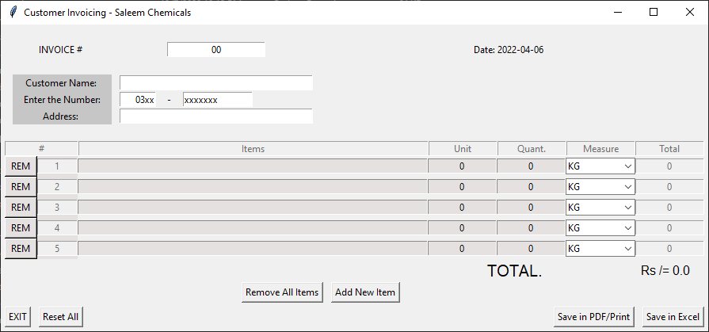
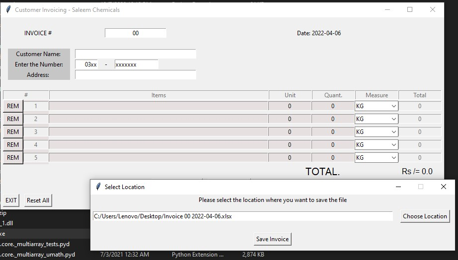

# ShopPOS
This is a very basic POS created in Python using tkinter and a library "openpyxl". This project might have some bugs and some unoptimized code as it was my first project with tkinter.

- Please, dont clone **without informing** first.   
## A couple of screenshot of the program:

